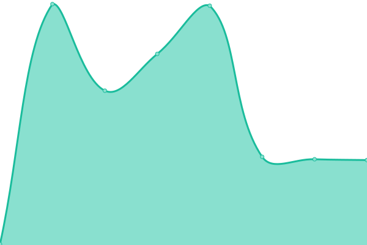
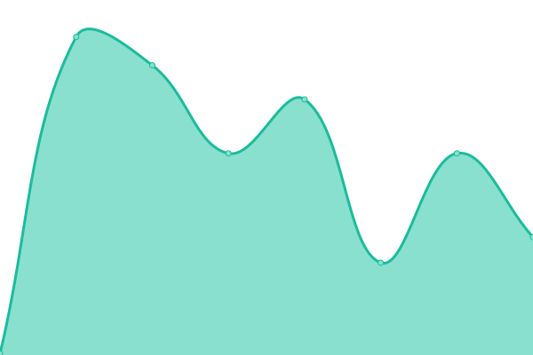
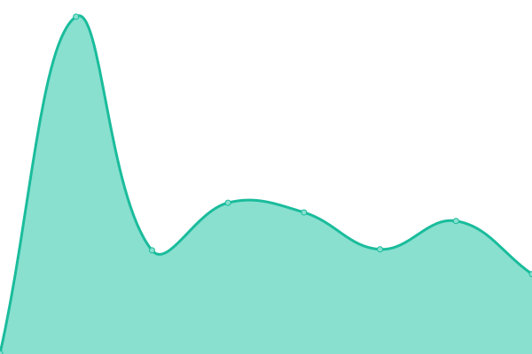
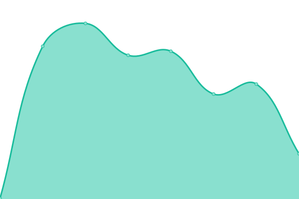
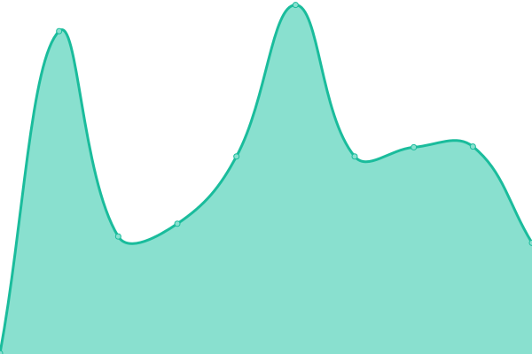

# [📈 Live Status](https://dzoladz.github.io/status): <!--live status--> **🟧 Partial outage**

This repository contains the open-source uptime monitor and status page for [Derek C. Zoladz](https://www.derekzoladz.com), powered by [Upptime](https://github.com/upptime/upptime).

With [Upptime](https://upptime.js.org), you can get your own unlimited and free uptime monitor and status page, powered entirely by a GitHub repository. We use [Issues](https://github.com/dzoladz/status/issues) as incident reports, [Actions](https://github.com/dzoladz/status/actions) as uptime monitors, and [Pages](https://dzoladz.github.io/status) for the status page.

<!--start: status pages-->
<!-- This summary is generated by Upptime (https://github.com/upptime/upptime) -->
<!-- Do not edit this manually, your changes will be overwritten -->
<!-- prettier-ignore -->
| URL | Status | History | Response Time | Uptime |
| --- | ------ | ------- | ------------- | ------ |
|  [Personal Website](https://www.derekzoladz.com/) | 🟩 Up | [personal-website.yml](https://github.com/dzoladz/status/commits/HEAD/history/personal-website.yml) | 

 140ms
     
 | 

<a href="https://dzoladz.github.io/status/history/personal-website">100.00%</a>
    

|  Koha | 🟥 Down | [koha.yml](https://github.com/dzoladz/status/commits/HEAD/history/koha.yml) | 

 132ms
     
 | 

<a href="https://dzoladz.github.io/status/history/koha">0.00%</a>
    

|  [CuriousitariumDCZ](https://dzoladz.github.io/curiousitarium/) | 🟩 Up | [curiousitarium-dcz.yml](https://github.com/dzoladz/status/commits/HEAD/history/curiousitarium-dcz.yml) | 

 61ms
     
 | 

<a href="https://dzoladz.github.io/status/history/curiousitarium-dcz">100.00%</a>
    

|  [TEDSIG 2020](https://tedsig.alaoweb.org/) | 🟩 Up | [tedsig-2020.yml](https://github.com/dzoladz/status/commits/HEAD/history/tedsig-2020.yml) | 

 185ms
     
 | 

<a href="https://dzoladz.github.io/status/history/tedsig-2020">100.00%</a>
    

|  [TEDSIG Speculative Library Futures](https://futures.alaoweb.org/) | 🟩 Up | [tedsig-speculative-library-futures.yml](https://github.com/dzoladz/status/commits/HEAD/history/tedsig-speculative-library-futures.yml) | 

 172ms
     
 | 

<a href="https://dzoladz.github.io/status/history/tedsig-speculative-library-futures">100.00%</a>
    

|  [ALAO 2020](https://2020.alaoweb.org/) | 🟩 Up | [alao-2020.yml](https://github.com/dzoladz/status/commits/HEAD/history/alao-2020.yml) | 

 258ms
     
 | 

<a href="https://dzoladz.github.io/status/history/alao-2020">100.00%</a>
    

<!--end: status pages-->

[**Visit our status website →**](https://dzoladz.github.io/status)

## 📄 License

- Powered by: [Upptime](https://github.com/upptime/upptime)
- Code: [MIT](./LICENSE) © [Derek C. Zoladz](https://www.derekzoladz.com)
- Data in the `./history` directory: [Open Database License](https://opendatacommons.org/licenses/odbl/1-0/)
